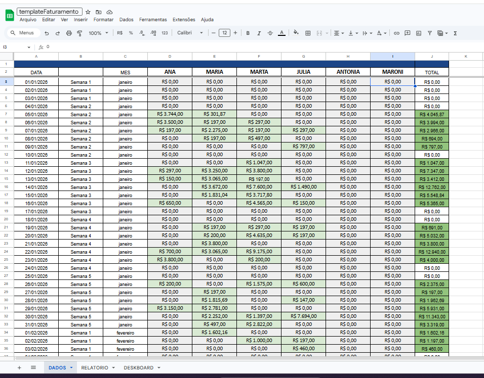
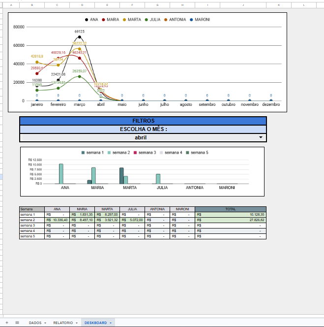
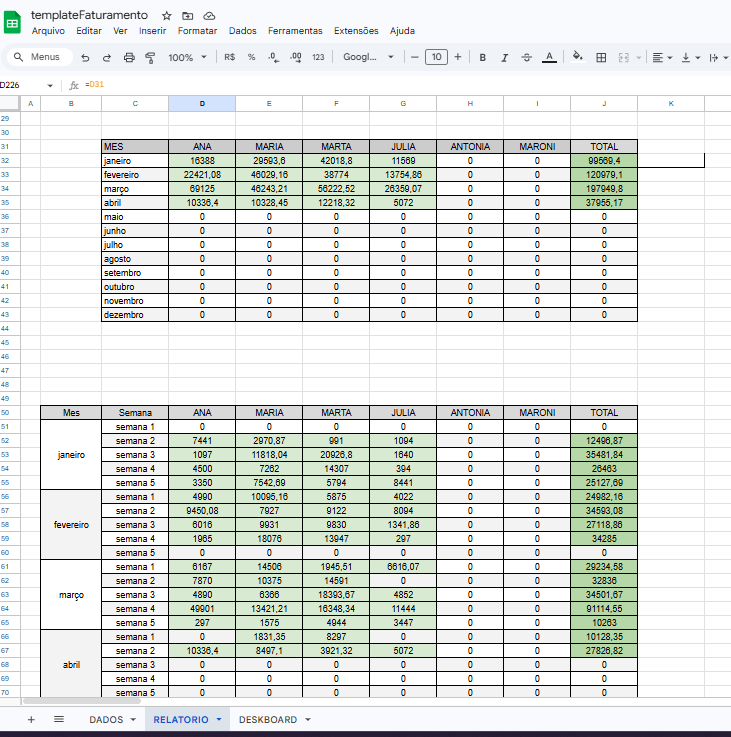

# template-faturamento
Template de planilha de faturamento automatizado para freelancers e pequenos negócios.

## 📊 Funcionalidades

**Fluxo de Caixa:** Registro de entradas e controle diário.

**Dashboard Visual:** Gráficos automáticos de desempenho mensal e anual.

**Relatórios:** Visão detalhada do desempenho anual, mensal e semanal.

**Controle Diário:** Lançamentos individuais com soma total faturada por dia.

## 📸 Screenshots
Aqui você pode ver uma prévia da planilha:

## 🚀 Como usar

Acesse o link para [FAZER UMA CÓPIA](https://docs.google.com/spreadsheets/d/19F7Za8Y6oYJh6REVrLocha_NVvUWWAOMaoLqXwwLyhQ/copy).

Ao abrir, escolha a opção de fazer uma cópia para o seu Drive. (Este projeto utiliza apenas fórmulas nativas, sem scripts).

Na aba **Dados**, substitua os nomes a partir da coluna **D** pelos nomes dos seus vendedores ou categorias.

## ℹ️ Informações Adicionais
Para instruções detalhadas, consulte o arquivo de [INSTRUÇÕES](./InfoSheets/instruções.txt).

---
Mantido por **Ivo Leal dos Reis**
